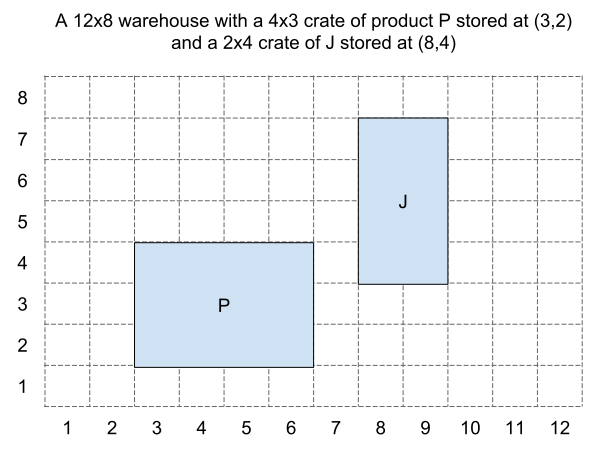

# Simple Warehouse
This is a simple command-line warehouse management tool. The user can record the storage and removal of crates of variable sizes on a grid of dynamic 'shelves'.

It accepts the following 7 commands:

| Command | Description |
| --- | --- |
| `help` | Shows the help message. |
| `init W H` | (Re)Initialises the application as an empty W x H warehouse. |
| `store X Y W H P` | Stores a crate of product code P and of size W x H at position (X,Y). The crate will occupy W x H locations on the grid.|
| `locate P` | Show a list of all locations occupied by product code P. |
| `remove X Y` | Remove the entire crate occupying the location (X,Y). |
| `view` | Output a visual representation of the current state of the grid. Position (1,1) should be at the bottom left position on the grid and (1, H) should be the top left. |
| `exit` | Exits the application. |

- Arguments W, H, X and Y will always be integers, and P will always be a single character.
- You should not worry about validating the format of the input.
- A crate of dimensions 2 x 3 will occupy 6 locations in the grid.

The user should be shown a graceful error message when:
- Trying to store a crate at a position which doesn't exist.
- Trying to store a crate which doesn't fit.
- Trying to remove a crate which doesn't exist.

## Task
Adapt the provided skeleton application with the functionality described above.  Feel free to improve the existing code as you see fit.

We recommend writing unit tests for your code in either RSpec or Minitest to ensure the correct functionality is
achieved.  However, to save time, we suggest you do not write full integration tests that simulate `stdin` and capture `stdout`.

Overwrite this `README`, outlining the reasoning behind your design decisions and any ways in which you think your code could be improved.  If you need to refer back to these instructions, [they are duplicated here](./INSTRUCTIONS.md).

Please return an archive (`.zip` or `tar.gz`) of your local repository.

### Alternatives to Ruby
If you feel your skills are better demonstrated in a different language, please feel free to submit your solution in the language of your choice.  Be sure to include full instructions on how to build and run your code.
